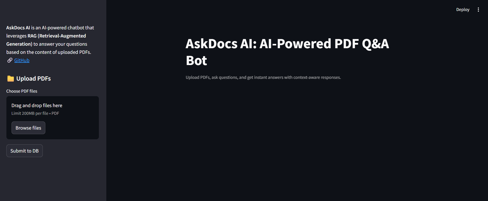

# AskDocs AI: AI-Powered PDF Q&A Bot

**AskDocs AI** is an AI-powered chatbot that leverages **RAG (Retrieval-Augmented Generation)** to answer your questions based on the content of uploaded PDFs.




## Tech Stack

- Python
- Langchain
- ChromaDB
- Streamlit
- Groq cloud 

## Setup Instruction

```sh
python -m venv venv
venv\Scripts\activate # Windows
source venv/bin/activate # macOS/Linux
pip install -r requirements.txt
streamlit run main.py
```
